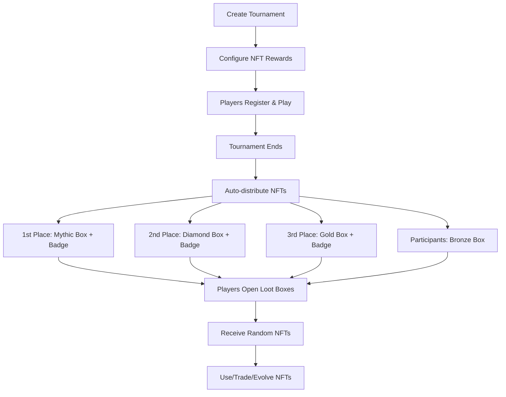

# 🎮 Gamified NFT Implementation - Complete Package

## 📦 What You Received

A comprehensive, production-ready gamified NFT system for **Avalanche Rush** with the following components:

### Smart Contracts (4 Contracts)

1. **[GameNFTSystem.sol](contracts/GameNFTSystem.sol)** - Core NFT management
   - 5 NFT types: Achievement, PowerUp, Evolution, LootBox, Special
   - 5 rarity tiers: Common → Mythic
   - Experience/leveling system
   - Power bonus tracking
   - Role-based access control

2. **[LootBoxNFT.sol](contracts/LootBoxNFT.sol)** - Loot box mechanics
   - 5 loot box tiers with weighted rewards
   - Cooldown system
   - Eligibility tracking
   - Random reward distribution

3. **[NFTMarketplace.sol](contracts/NFTMarketplace.sol)** - P2P trading
   - Buy/sell listings
   - Offer system
   - Marketplace fees
   - Trading statistics

4. **[TournamentNFTRewards.sol](contracts/TournamentNFTRewards.sol)** - Tournament integration
   - Automated reward distribution
   - Configurable per tournament
   - Achievement minting for winners
   - Experience point awards

### Frontend Components (3 Files)

1. **[useNFTSystem.ts](src/hooks/useNFTSystem.ts)** - React hook for NFT interactions
   - Load player NFTs
   - Evolve/activate functions
   - Loot box operations
   - Marketplace integration

2. **[NFTGallery.tsx](src/components/nft/NFTGallery.tsx)** - NFT collection display
   - Tabbed interface by type
   - Stats overview
   - Evolution progress
   - Interactive actions

3. **[LootBoxSystem.tsx](src/components/nft/LootBoxSystem.tsx)** - Loot box UI
   - Tier-based styling
   - Drop rate visualization
   - Opening animations
   - Eligibility tracking

### Deployment Scripts (3 Scripts)

1. **[deploy-gamified-nfts.js](scripts/deploy-gamified-nfts.js)** - Main deployment
   - Deploys all 4 contracts
   - Sets up access control
   - Creates loot box tiers
   - Adds sample reward pools

2. **[setup-tournament-rewards.js](scripts/setup-tournament-rewards.js)** - Tournament configuration
   - Auto-configures rewards for tournaments
   - Tier-based reward assignment
   - Achievement URI setup

3. **[test-nft-flow.js](scripts/test-nft-flow.js)** - Complete testing
   - Tests all NFT types
   - Evolution system
   - Loot boxes
   - Marketplace
   - Player stats

### Documentation (2 Guides)

1. **[GAMIFIED_NFT_GUIDE.md](GAMIFIED_NFT_GUIDE.md)** - Complete integration guide
2. **NFT_IMPLEMENTATION_SUMMARY.md** - This file

---

## 🚀 Quick Start Guide

### Step 1: Deploy Contracts

```bash
# Make sure your .env has RUSH_TOKEN and SCORE_MANAGER addresses
npx hardhat run scripts/deploy-gamified-nfts.js --network avalanche
```

This will:
- ✅ Deploy all 4 contracts
- ✅ Setup access control
- ✅ Create 5 loot box tiers
- ✅ Add sample reward pools
- ✅ Output contract addresses

### Step 2: Update Environment Variables

Add to your `.env`:

```env
VITE_NFT_SYSTEM=0x...
VITE_LOOTBOX=0x...
VITE_MARKETPLACE=0x...
VITE_TOURNAMENT_REWARDS=0x...
```

### Step 3: Configure Tournament Rewards

```bash
npx hardhat run scripts/setup-tournament-rewards.js --network avalanche
```

This automatically configures NFT rewards for all active tournaments.

### Step 4: Test the System

```bash
npx hardhat run scripts/test-nft-flow.js --network avalanche
```

Tests all NFT functionality end-to-end.

### Step 5: Integrate Frontend

```typescript
// In your game component
import { NFTGallery } from '@/components/nft/NFTGallery';
import { LootBoxSystem } from '@/components/nft/LootBoxSystem';
import { useNFTSystem } from '@/hooks/useNFTSystem';

function GameDashboard() {
  const { playerNFTs, powerBonus } = useNFTSystem();

  return (
    <div>
      <p>Active Power Bonus: +{powerBonus}%</p>
      <NFTGallery />
      <LootBoxSystem />
    </div>
  );
}
```

---

## 🎯 Key Features

### 1. Achievement NFTs
- Minted for tournament victories
- Permanent proof of accomplishments
- Collectible badges
- Social status

**Example:**
```solidity
nftSystem.mintAchievementNFT(
  player,
  "tournament_winner",
  "ipfs://achievement-uri",
  LEGENDARY
);
```

### 2. Power-up NFTs
- Temporary gameplay bonuses
- Stackable effects
- Limited duration
- Strategic usage

**Example:**
```solidity
nftSystem.mintPowerUpNFT(
  player,
  "ipfs://powerup-uri",
  20,    // +20% bonus
  3600,  // 1 hour
  EPIC
);
```

### 3. Evolution NFTs
- Upgradeable with experience
- Multiple level URIs
- Progressive unlocking
- Long-term progression

**Example:**
```solidity
// Gain XP from gameplay
nftSystem.addExperience(tokenId, 500);

// Evolve when threshold reached
nftSystem.evolveNFT(tokenId);
```

### 4. Loot Box System
- 5 tiers: Bronze → Mythic
- Weighted random rewards
- Cooldown mechanics
- Tournament rewards

**Example:**
```javascript
// Grant eligibility to winner
await lootBox.grantEligibility(winner, DIAMOND_BOX);

// Player opens box
await lootBox.openLootBox(DIAMOND_BOX);
```

### 5. NFT Marketplace
- P2P trading
- Offer system
- Marketplace fees
- Trading stats

**Example:**
```typescript
// List NFT for sale
await listNFTForSale(tokenId, "10.0"); // 10 RUSH tokens

// Buy NFT
await buyNFT(listingId, price);
```

---

## 🎨 NFT Types & Use Cases

| NFT Type | Primary Function | Game Impact | Persistence |
|----------|------------------|-------------|-------------|
| **Achievement** | Tournament victories | Social proof, collection | Permanent |
| **Power-up** | Gameplay bonuses | Score multipliers, speed | Temporary |
| **Evolution** | Character progression | Unlocks, abilities | Upgradeable |
| **Loot Box** | Mystery rewards | Variety, excitement | One-time use |
| **Special** | Limited editions | Exclusivity | Permanent |

---

## 🏆 Tournament Integration Flow



---

## 💡 Advanced Features

### 1. Experience System

```solidity
// Award XP based on performance
function awardExperiencePoints(uint256 tournamentId, address player, uint256 xp) {
    uint256[] memory nfts = nftSystem.getPlayerNFTs(player);

    for (uint256 i = 0; i < nfts.length; i++) {
        if (isEvolutionNFT(nfts[i])) {
            nftSystem.addExperience(nfts[i], xp);
        }
    }
}
```

### 2. Power Bonus Application

```typescript
// In game logic
const applyBonuses = (baseScore: number, playerAddress: string) => {
  const { powerBonus } = useNFTSystem();
  return baseScore * (1 + powerBonus / 100);
};
```

### 3. Batch Reward Distribution

```solidity
// After tournament
address[] memory winners = getTopPlayers(tournamentId);
uint256[] memory lootBoxes = [MYTHIC, DIAMOND, GOLD];

for (uint256 i = 0; i < winners.length; i++) {
    lootBox.grantEligibility(winners[i], lootBoxes[i]);
}
```

### 4. Marketplace Analytics

```javascript
const stats = await marketplace.marketStats();
console.log('Total Volume:', ethers.utils.formatEther(stats.totalVolume));
console.log('Average Price:', ethers.utils.formatEther(stats.averagePrice));
```

---

## 🔒 Security Features

- ✅ **ReentrancyGuard** on all state-changing functions
- ✅ **Role-based access control** (MINTER_ROLE, GAME_ADMIN)
- ✅ **Approval checks** for NFT transfers
- ✅ **Cooldown enforcement** to prevent spam
- ✅ **Ownership verification** before operations
- ✅ **OpenZeppelin battle-tested contracts**

---

## 📊 Gas Optimization

- Batch operations supported
- Efficient storage patterns
- Minimal external calls
- Event-driven indexing
- Optimized for Avalanche C-Chain

---

## 🎯 Customization Options

### 1. Add New Loot Box Tiers

```javascript
const customBoxId = await lootBox.createLootBox(
  "Legendary Vault",
  5, // Custom tier
  10800 // 3 hour cooldown
);
```

### 2. Modify Reward Pools

```javascript
await lootBox.addRewardPool(
  boxId,
  POWERUP,
  MYTHIC,
  100, // 100% chance
  ["ipfs://custom-uri"],
  50, // +50% bonus
  7200
);
```

### 3. Custom Achievement Categories

```javascript
await nftSystem.mintAchievementNFT(
  player,
  "speedrun_champion", // Custom category
  "ipfs://speedrun-badge",
  LEGENDARY
);
```

### 4. Dynamic Marketplace Fees

```javascript
// Update marketplace fee (owner only)
await marketplace.updateMarketplaceFee(500); // 5%
```

---

## 📈 Metrics & Analytics

Track engagement with these metrics:

```typescript
// Player engagement
const stats = await nftSystem.playerStats(player);
console.log('Collection size:', stats.totalNFTs);
console.log('Engagement level:', stats.totalExperience);

// Economic activity
const marketStats = await marketplace.marketStats();
console.log('Trading volume:', marketStats.totalVolume);
console.log('Market liquidity:', marketStats.totalListings);

// Retention indicators
const lootStats = await lootBox.getPlayerStats(player);
console.log('Boxes opened:', lootStats.totalOpened);
```

---

## 🛠️ Troubleshooting

### Issue: NFT won't mint
**Solution:** Check if caller has MINTER_ROLE
```javascript
const MINTER_ROLE = ethers.utils.keccak256(ethers.utils.toUtf8Bytes("MINTER_ROLE"));
await nftSystem.grantRole(MINTER_ROLE, minterAddress);
```

### Issue: Can't open loot box
**Solution:** Check eligibility and cooldown
```javascript
const [eligible, cooledDown] = await lootBox.canOpenLootBox(player, boxId);
console.log('Eligible:', eligible, 'Cooled down:', cooledDown);
```

### Issue: Evolution won't trigger
**Solution:** Check XP threshold
```javascript
const details = await nftSystem.getNFTDetails(tokenId);
const required = currentLevel * 100 * (currentLevel + 1) / 2;
console.log('XP:', details[0].experiencePoints, 'Required:', required);
```

---

## 🌟 Best Practices

1. **Upload metadata to IPFS** before minting
2. **Test on testnet** before mainnet deployment
3. **Verify contracts** on SnowTrace
4. **Set reasonable cooldowns** to prevent spam
5. **Monitor gas costs** and optimize batch operations
6. **Track player engagement** with analytics
7. **Update reward pools** based on player feedback
8. **Maintain fair marketplace** fees

---

## 🔗 Integration Checklist

- [x] Smart contracts deployed
- [x] Access control configured
- [x] Loot boxes created
- [x] Reward pools added
- [x] Tournament rewards configured
- [ ] NFT metadata uploaded to IPFS
- [ ] Frontend components integrated
- [ ] Testing on testnet
- [ ] Contracts verified on SnowTrace
- [ ] Production deployment

---

## 📞 Next Steps

1. **Deploy to testnet** and test thoroughly
2. **Upload NFT artwork** to IPFS
3. **Configure tournament rewards** for your events
4. **Integrate frontend components** into your game
5. **Monitor player engagement** and iterate
6. **Gather feedback** and add new features
7. **Scale reward pools** based on popularity

---

## 🎉 What This Enables

- ✅ **Tournament rewards** automatically distributed as NFTs
- ✅ **Player progression** through evolution and XP
- ✅ **Gameplay bonuses** via power-up NFTs
- ✅ **Economic activity** through P2P marketplace
- ✅ **Social proof** with achievement badges
- ✅ **Player retention** through loot box mechanics
- ✅ **Gamification** at every level
- ✅ **True ownership** of in-game assets

---

## 📚 Additional Resources

- Smart contracts: `contracts/`
- Frontend hooks: `src/hooks/useNFTSystem.ts`
- UI components: `src/components/nft/`
- Deployment scripts: `scripts/`
- Complete guide: `GAMIFIED_NFT_GUIDE.md`

---

**Built for Avalanche Rush** 🏔️❄️

This implementation provides a complete, production-ready gamified NFT system that enhances player engagement, creates economic value, and rewards skilled gameplay. All code is optimized for Avalanche C-Chain with low gas costs and fast finality.

Ready to deploy! 🚀
