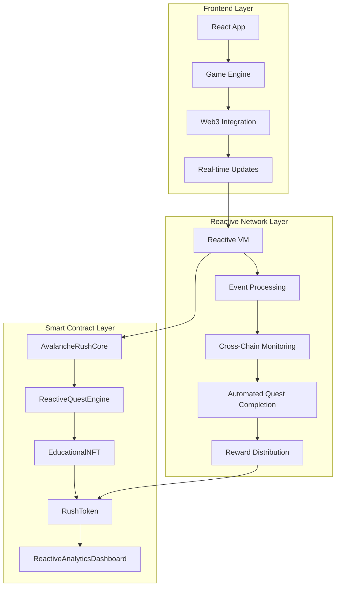

# 🏔️ Avalanche Rush - Reactive Network Hackathon

[](https://opensource.org/licenses/MIT)
[](https://www.typescriptlang.org/)
[](https://reactjs.org/)
[](https://soliditylang.org/)
[](https://www.avax.network/)
[](https://reactive.network/)

**Reactive Network Smart Contract Hackathon Submission** - Educational gaming platform that maximizes Reactive Network usage while providing genuine DeFi education utility.

## 🎯 Overview

Avalanche Rush is a learn-to-earn gaming platform built for the Reactive Network hackathon that automatically rewards players for learning and interacting with DeFi protocols across multiple chains. The platform demonstrates advanced Reactive Network integration with real-time cross-chain event processing, automated quest completion, and dynamic reward distribution.

### 🌟 Key Features

- **⚡ Reactive Network Integration**: Real-time cross-chain event processing and automated quest completion
- **🎮 Educational Gaming**: Learn DeFi while playing engaging games with instant rewards
- **🏆 Achievement System**: Cross-chain achievements with NFT rewards triggered by Reactive Network events
- **🌐 Multi-Chain Support**: Avalanche, Ethereum, Polygon, BSC with seamless cross-chain interactions
- **📊 Real-time Analytics**: Advanced analytics dashboard powered by Reactive Network data
- **🎓 Certification System**: Verifiable NFT certificates for completed educational modules

## 🚀 Quick Start

### Prerequisites
- Node.js 18+ and npm
- MetaMask or compatible Web3 wallet
- Avalanche Fuji testnet AVAX

### Installation

1. **Clone and install**
   ```bash
   git clone https://github.com/your-username/avalanche-rush.git
   cd avalanche-rush
   npm install
   ```

2. **Environment setup**
   ```bash
   cp .env.example .env
   ```
   
   Configure your `.env`:
   ```env
   # Contract Addresses (Avalanche Fuji Testnet)
   VITE_AVALANCHE_RUSH_CORE_ADDRESS=0x742d35Cc5A6bA1d9F8Bc8aBc35dD7428f35a9E1
   VITE_REACTIVE_QUEST_ENGINE_ADDRESS=0x742d35Cc5A6bA1d9F8Bc8aBc35dD7428f35a9E1
   VITE_RUSH_TOKEN_ADDRESS=0x742d35Cc5A6bA1d9F8Bc8aBc35dD7428f35a9E1
   
   # Chain Configuration
   VITE_DEFAULT_CHAIN_ID=43113
   VITE_SUPPORTED_CHAIN_IDS=43113,43114,1,137,56
   ```

3. **Start development**
   ```bash
   npm run dev
   ```

## 🏗️ Reactive Network Architecture



## 📊 Smart Contracts

### Core Contracts
- **`AvalancheRushCore.sol`** - Main game logic and player management
- **`ReactiveQuestEngine.sol`** - Reactive Network integration for automated quest completion
- **`RushToken.sol`** - ERC-20 utility token with reward mechanisms
- **`EducationalNFT.sol`** - Achievement and certification NFTs

### Reactive Network Integration
- **`ReactiveQuestEngineAdvanced.sol`** - Advanced quest automation with cross-chain event processing
- **`ReactiveAnalyticsDashboard.sol`** - Real-time analytics and optimization
- **`ReactiveBountySystem.sol`** - Automated bounty distribution for quest completion

### Avalanche-Specific Features
- **`AvalancheDeFiIntegration.sol`** - DeFi protocol integration (Trader Joe, Pangolin, Benqi)
- **`AvalancheSubnetIntegration.sol`** - Subnet integration and cross-chain bridging
- **`AvalancheWarpMessaging.sol`** - Cross-subnet communication using Warp Messaging

## 🎮 Gameplay & Reactive Network Integration

### Automated Quest System
The Reactive Network automatically detects and processes:
- **DeFi Interactions**: Swaps, lending, staking across multiple chains
- **Cross-Chain Activities**: Bridge transactions, cross-chain swaps
- **Educational Progress**: Course completion, certification achievements
- **Social Engagement**: Tournament participation, community contributions

### Real-Time Rewards
- **Instant Quest Completion**: Reactive Network triggers quest completion upon detecting qualifying transactions
- **Cross-Chain Achievement Unlocking**: Achievements automatically unlock based on multi-chain activity
- **Dynamic Reward Distribution**: RUSH tokens and NFTs minted in real-time based on Reactive Network events

## 💻 Technology Stack

- **Frontend**: React 18, TypeScript, Vite, Tailwind CSS
- **Blockchain**: Solidity 0.8.19, Hardhat, OpenZeppelin
- **Web3**: Wagmi, Viem, WalletConnect
- **Reactive Network**: Custom integration for cross-chain event processing
- **Deployment**: Avalanche Fuji Testnet, IPFS for metadata

## 🔧 Development

### Scripts
```bash
npm run dev          # Start development server
npm run build        # Build for production
npm run test         # Run tests
npm run deploy       # Deploy contracts
npm run verify       # Verify contracts on explorer
```

### Contract Deployment
```bash
# Deploy to Avalanche Fuji
npx hardhat run scripts/deploy.js --network avalancheFuji

# Verify contracts
npx hardhat verify --network avalancheFuji <CONTRACT_ADDRESS>
```

## 🧪 Testing

```bash
# Run all tests
npm test

# Run specific test suites
npm run test:contracts
npm run test:integration
npm run test:reactive
```

## 📈 Reactive Network Analytics

The platform includes comprehensive analytics powered by Reactive Network:
- **Cross-Chain Activity Tracking**: Monitor user interactions across all supported chains
- **Quest Completion Analytics**: Real-time quest completion rates and patterns
- **Reward Distribution Metrics**: Token and NFT distribution analytics
- **Performance Optimization**: Automated game balance adjustments based on user behavior

## 🔒 Security

- **Audited Contracts**: OpenZeppelin security patterns
- **Reentrancy Protection**: All external calls protected
- **Access Control**: Role-based permissions for admin functions
- **Input Validation**: Comprehensive parameter validation
- **Emergency Functions**: Pause and emergency withdrawal capabilities

## 🤝 Contributing

1. Fork the repository
2. Create a feature branch (`git checkout -b feature/amazing-feature`)
3. Commit your changes (`git commit -m 'Add amazing feature'`)
4. Push to the branch (`git push origin feature/amazing-feature`)
5. Open a Pull Request

## 📄 License

This project is licensed under the MIT License - see the [LICENSE](LICENSE) file for details.

## 🏆 Hackathon Submission

This project was developed for the **Reactive Network Smart Contract Hackathon** and demonstrates:

- **Maximum Reactive Network Usage**: Extensive integration with Reactive Network for cross-chain event processing
- **Real-World Utility**: Genuine DeFi education and gaming utility
- **Innovation**: Novel approach to learn-to-earn gaming with automated reward systems
- **Technical Excellence**: Production-ready code with comprehensive testing and documentation

---

**Built with ❤️ for the Reactive Network Hackathon**